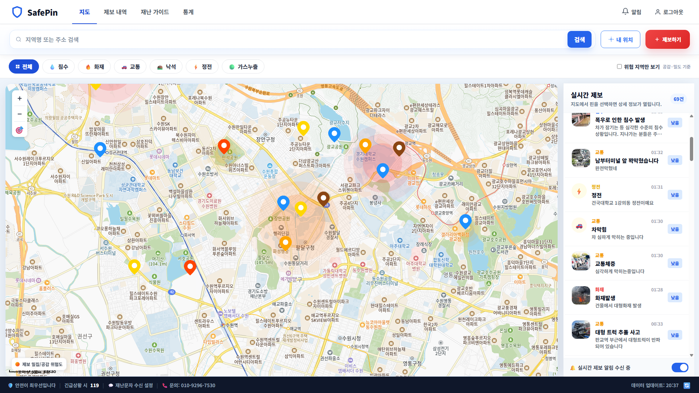
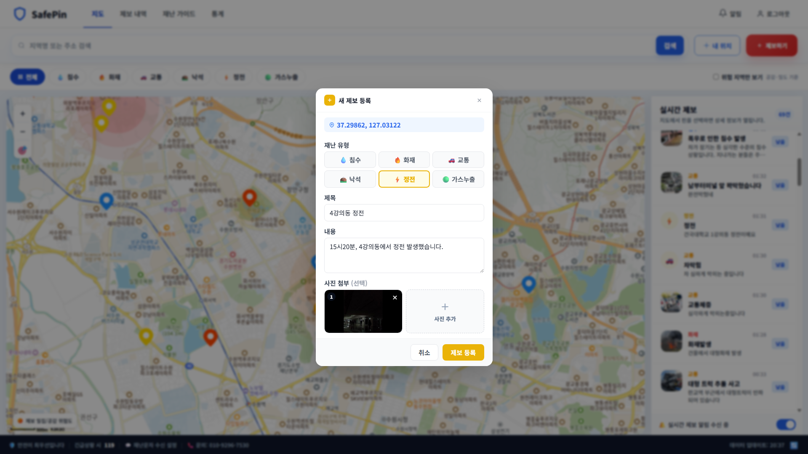
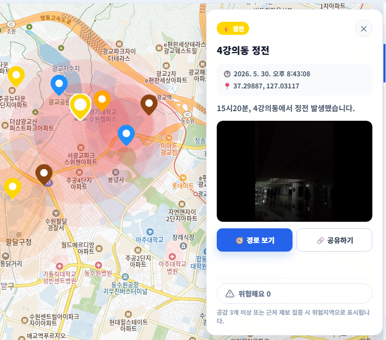
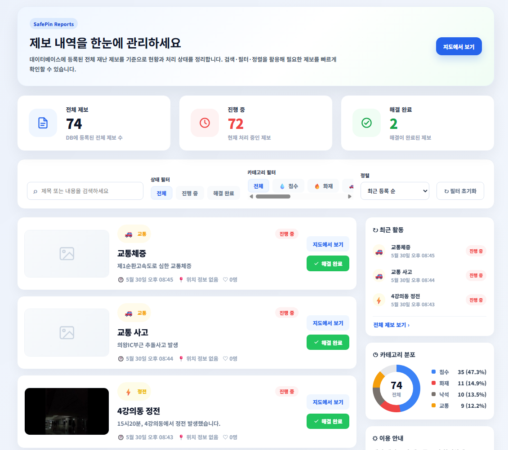
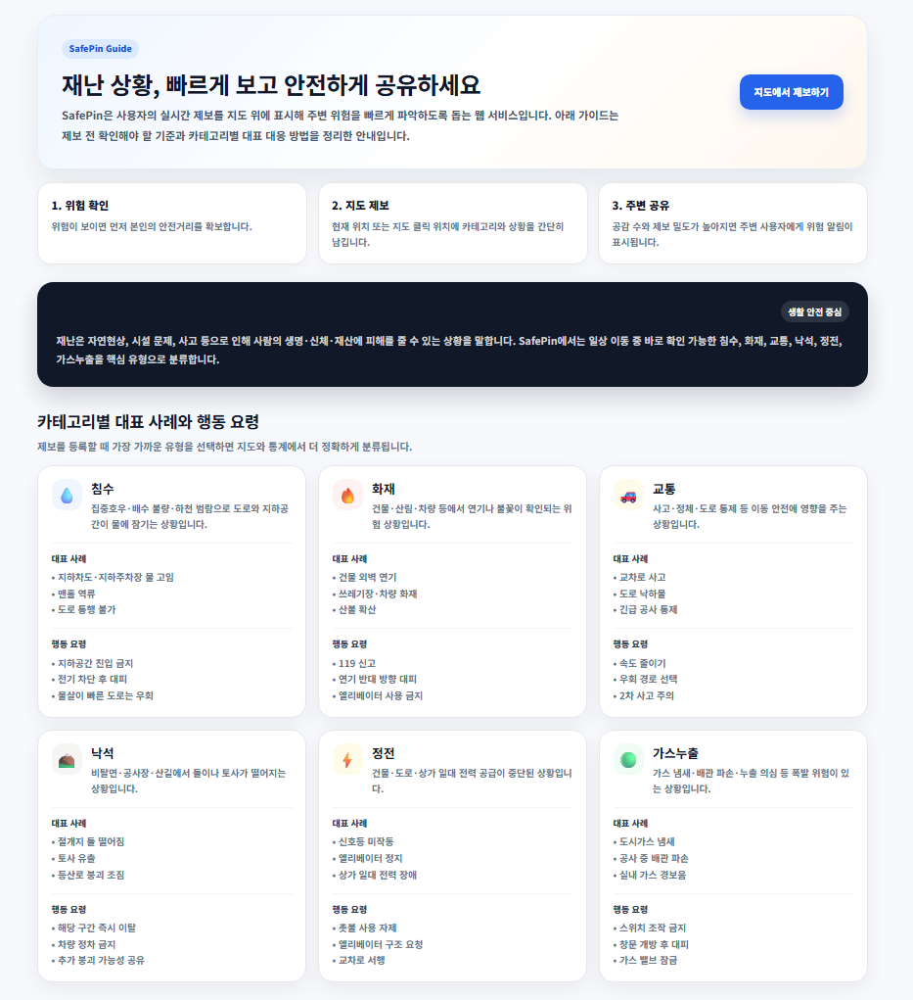
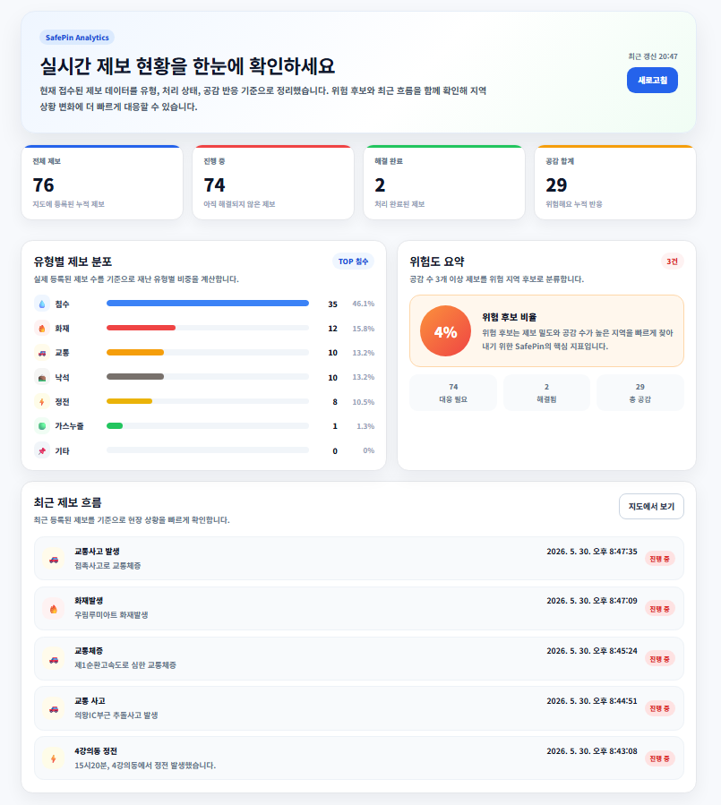
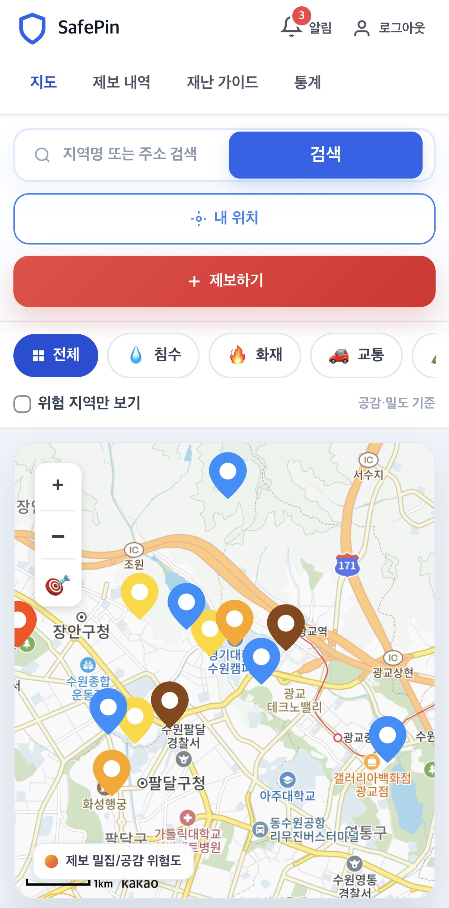
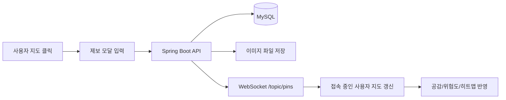

# SafePin — 실시간 재난 안전 지도

> 시민이 직접 등록한 재난·안전 제보를 지도 위에서 실시간으로 공유하는 웹 기반 플랫폼입니다.

SafePin은 침수, 화재, 교통, 낙석, 정전, 가스누출과 같은 위험 상황을 지도 기반으로 빠르게 제보하고 확인할 수 있도록 만든 팀 프로젝트입니다. 별도의 앱 설치 없이 웹 URL로 접근할 수 있으며, 제보 등록 즉시 다른 사용자 화면에도 핀이 반영되는 것을 목표로 구현했습니다.

<br />

## 📌 프로젝트 요약

| 항목 | 내용 |
| --- | --- |
| 프로젝트명 | SafePin |
| 개발 기간 | 2026.05 |
| 형태 | 웹 프로그래밍 팀 프로젝트 |
| 핵심 기능 | 지도 기반 제보, 실시간 핀 반영, 공감/위험도 표시, 히트맵, 제보 이력 관리 |
| 주요 기술 | React, Vite, Kakao Maps SDK, Spring Boot, WebSocket/STOMP, MySQL |

<br />

## 🖼️ 화면 미리보기

### 메인 지도 화면



### 새 제보 등록 모달



### 핀 상세 정보 및 이미지 갤러리



### 제보 내역 화면



### 재난 가이드 화면



### 통계 화면



### 모바일 반응형 화면



<br />

## ✨ 주요 기능

### 1. 지도 기반 재난 제보

- Kakao Maps 기반 지도 화면에서 위치를 선택해 제보를 등록할 수 있습니다.
- 제보 유형은 침수, 화재, 교통, 낙석, 정전, 가스누출로 구분됩니다.
- 제목, 내용, 위치, 사진을 함께 등록할 수 있으며 여러 장의 이미지를 첨부할 수 있습니다.

### 2. 실시간 핀 반영

- 새 제보가 등록되면 WebSocket(STOMP)을 통해 접속 중인 사용자에게 즉시 전달됩니다.
- 지도 위 핀과 우측 실시간 제보 목록이 함께 갱신됩니다.

### 3. 제보 상세 확인

- 지도 핀 또는 제보 목록을 선택하면 상세 패널에서 제목, 내용, 좌표, 등록 시각, 사진을 확인할 수 있습니다.
- 사진이 여러 장인 경우 갤러리 형태로 넘겨볼 수 있습니다.
- Kakao Map 경로 보기와 공유 기능을 제공합니다.

### 4. 공감 기반 위험도 표시

- 사용자는 제보에 “위험해요” 공감을 남길 수 있습니다.
- 동일 사용자의 중복 공감은 DB 제약 조건으로 방지합니다.
- 공감 수와 주변 제보 밀도를 함께 반영해 위험 지역 후보를 표시합니다.

### 5. 히트맵 시각화

- 제보가 가까운 범위에 집중되거나 공감 수가 높아지면 지도 위에 히트맵이 표시됩니다.
- `공감 수 + 주변 제보 수` 기준으로 위험 지역을 계산합니다.
- 위험 지역만 보기 필터를 통해 위험 후보 지역 중심으로 확인할 수 있습니다.

### 6. 제보 내역 관리

- 전체 제보, 진행 중 제보, 해결 완료 제보를 확인할 수 있습니다.
- 검색, 카테고리 필터, 상태 필터, 정렬 기능을 제공합니다.
- 제보자는 자신의 제보를 해결 완료 처리할 수 있습니다.

### 7. 재난 가이드 및 통계

- 재난 유형별 대표 사례와 행동 요령을 정리한 가이드 화면을 제공합니다.
- 통계 화면에서는 유형별 제보 분포, 진행 상태, 공감 합계, 위험도 요약을 확인할 수 있습니다.

<br />

## 🧱 기술 스택

### Frontend

| 기술 | 사용 목적 |
| --- | --- |
| React 18 | 화면 구성 및 상태 관리 |
| Vite | 프론트엔드 개발 서버 및 빌드 |
| React Router | 페이지 라우팅 |
| Kakao Maps SDK | 지도, 마커, 경로 이동 |
| Axios | REST API 통신 |
| STOMP.js / SockJS | WebSocket 실시간 통신 |
| heatmap.js / Kakao Map Overlay | 위험 지역 시각화 |

### Backend

| 기술 | 사용 목적 |
| --- | --- |
| Java 17 | 백엔드 개발 언어 |
| Spring Boot 3.4.5 | 백엔드 애플리케이션 구성 |
| Spring Web | REST API 구현 |
| Spring Data JPA | DB 접근 및 엔티티 관리 |
| Spring Security | 비밀번호 암호화 및 기본 보안 설정 |
| Spring WebSocket / STOMP | 실시간 제보, 공감, 알림 브로드캐스트 |
| MySQL 8.0 | 회원, 제보, 이미지, 공감, 카테고리 데이터 저장 |

<br />

## 🗂️ 프로젝트 구조

```text
SafePin/
├─ backend/
│  ├─ src/main/java/com/kyonggi/disaster/
│  │  ├─ category/          # 재난 카테고리 API
│  │  ├─ common/            # 공통 응답, 예외 처리
│  │  ├─ config/            # CORS, Security, WebSocket, 파일 설정
│  │  ├─ member/            # 회원가입, 로그인
│  │  ├─ report/            # 제보 등록, 조회, 이미지 업로드, 해결 처리
│  │  ├─ sympathy/          # 공감 토글 및 실시간 반영
│  │  └─ websocket/         # 실시간 핀 메시지
│  ├─ src/main/resources/
│  │  └─ application-example.yml
│  ├─ disaster_schema.sql
│  └─ build.gradle
│
├─ frontend/
│  ├─ src/
│  │  ├─ api/               # Axios API 모듈
│  │  ├─ components/
│  │  │  ├─ auth/            # 로그인/회원가입 폼
│  │  │  ├─ common/          # Header, Alert, CategoryFilter 등
│  │  │  ├─ map/             # KakaoMap, HeatmapLayer
│  │  │  ├─ report/          # 제보 카드, 피드, 모달
│  │  │  └─ sympathy/        # 공감 버튼
│  │  ├─ hooks/              # 인증, WebSocket Hook
│  │  ├─ pages/              # 지도, 제보내역, 가이드, 통계 페이지
│  │  ├─ styles/             # 전역 스타일 및 반응형 CSS
│  │  └─ utils/              # 카테고리/이미지 URL 유틸
│  ├─ .env.example
│  └─ package.json
│
└─ README.md
```

<br />

## 🔄 서비스 흐름



<br />

## 🧩 핵심 구현 포인트

### 지도와 실시간 데이터 동기화

제보 등록 후 REST API로 DB에 저장하고, 같은 시점에 WebSocket 채널로 새 핀 정보를 브로드캐스트합니다. 프론트엔드는 `/topic/pins`, `/topic/sympathy`, `/topic/alert` 채널을 구독하여 지도, 피드, 알림 상태를 갱신합니다.

### 이미지 업로드 및 표시

제보 이미지는 `multipart/form-data`로 전송하며, 서버 로컬 업로드 폴더에 저장한 뒤 DB에는 파일명과 원본명을 기록합니다. 프론트에서는 API 응답의 `imageUrls`를 기준으로 상세 패널과 제보 카드 썸네일을 표시합니다.

### 위험 지역 판단

단순히 제보 수만 보는 대신, 주변 제보 밀도와 공감 수를 함께 사용해 위험 지역 후보를 계산합니다. 계산 결과가 기준값을 넘으면 지도 위에 부드러운 히트맵 형태로 표시합니다.

### 반응형 UI

데스크톱에서는 지도와 실시간 피드를 나란히 보여주고, 모바일에서는 검색, 필터, 지도, 제보 목록이 세로 흐름으로 자연스럽게 배치되도록 구성했습니다.

<br />

## 🔌 REST API 요약

### Member API

| Method | URL | 설명 |
| --- | --- | --- |
| POST | `/api/members/signup` | 회원가입 |
| POST | `/api/members/login` | 로그인 및 memberId 반환 |

### Category API

| Method | URL | 설명 |
| --- | --- | --- |
| GET | `/api/categories` | 전체 재난 카테고리 조회 |

### Report API

| Method | URL | 설명 |
| --- | --- | --- |
| POST | `/api/reports?memberId={memberId}` | 제보 등록. `multipart/form-data` 사용 |
| GET | `/api/reports` | 활성 제보 조회 |
| GET | `/api/reports/all` | 전체 제보 조회 |
| GET | `/api/reports?categoryId={id}` | 카테고리별 제보 조회 |
| GET | `/api/reports/my?memberId={memberId}` | 내 제보 조회 |
| PATCH | `/api/reports/{id}/resolve?memberId={memberId}` | 제보 해결 완료 처리 |

### Sympathy API

| Method | URL | 설명 |
| --- | --- | --- |
| POST | `/api/reports/{reportId}/sympathy?memberId={memberId}` | 공감 등록/취소 토글 |

<br />

## 📡 WebSocket 채널

| 채널 | 방향 | 설명 |
| --- | --- | --- |
| `/ws` | Client ↔ Server | SockJS 연결 엔드포인트 |
| `/topic/pins` | Server → Client | 새 제보 등록 시 전체 브로드캐스트 |
| `/topic/sympathy` | Server → Client | 공감 수 변경 실시간 반영 |
| `/topic/alert` | Server → Client | 위험 알림 브로드캐스트 |

<br />

## 🗄️ DB 스키마 요약

| 테이블 | 설명 |
| --- | --- |
| `member` | 회원 정보. 로그인 ID, 비밀번호, 닉네임, 성별 저장 |
| `category` | 재난 유형 정보. 이름, 아이콘, 색상 저장 |
| `report` | 제보 본문 정보. 위치, 상태, 등록/해결 시각 저장 |
| `report_image` | 제보 첨부 이미지 파일 정보 저장 |
| `sympathy` | 제보별 공감 정보. `(report_id, member_id)` unique 제약으로 중복 방지 |

<br />

## ⚙️ 실행 방법

### 1. 사전 준비

- JDK 17
- MySQL 8.0
- Node.js 18 이상 권장
- Kakao Developers JavaScript 키

### 2. DB 생성

MySQL에서 아래 스크립트를 실행합니다.

```sql
SOURCE backend/disaster_schema.sql;
```

또는 `backend/disaster_schema.sql` 내용을 MySQL Workbench에서 직접 실행합니다.

### 3. 백엔드 설정

`backend/src/main/resources/application-example.yml`을 복사해 `application.yml`을 생성합니다.

```bash
cp backend/src/main/resources/application-example.yml backend/src/main/resources/application.yml
```

예시:

```yml
spring:
  datasource:
    url: jdbc:mysql://localhost:3306/disaster_db?serverTimezone=Asia/Seoul&characterEncoding=UTF-8
    username: root
    password: your_password
    driver-class-name: com.mysql.cj.jdbc.Driver

server:
  address: 0.0.0.0
  port: 8080

file:
  upload-dir: uploads/images/
```

> `application.yml`에는 개인 DB 비밀번호가 들어가므로 Git에 올리지 않습니다.

백엔드 실행:

```bash
cd backend
./gradlew bootRun
```

Windows CMD에서는:

```bat
cd backend
gradlew bootRun
```

### 4. 프론트엔드 설정

`frontend/.env.example`을 참고해 `frontend/.env`를 생성합니다.

```env
VITE_KAKAO_MAP_KEY=your_kakao_javascript_key
VITE_API_BASE_URL=http://localhost:8080
VITE_WS_URL=http://localhost:8080/ws
```

프론트엔드 실행:

```bash
cd frontend
npm install
npm run dev
```

접속:

```text
http://localhost:5173
```

<br />

## 📱 같은 네트워크 모바일 테스트

PC와 휴대폰이 같은 Wi-Fi에 연결되어 있다면, 프론트를 다음처럼 실행합니다.

```bash
npm run dev -- --host 0.0.0.0
```

PC의 IP 주소를 확인합니다.

```bat
ipconfig
```

예를 들어 PC IP가 `192.168.0.3`이면 `.env`를 다음처럼 바꿉니다.

```env
VITE_API_BASE_URL=http://192.168.0.3:8080
VITE_WS_URL=http://192.168.0.3:8080/ws
```

휴대폰 브라우저에서는 아래 주소로 접속합니다.

```text
http://192.168.0.3:5173
```

Kakao Developers의 Web 플랫폼 도메인에도 아래 주소를 추가해야 지도 로딩이 정상 동작합니다.

```text
http://192.168.0.3:5173
```

<br />

## 🧪 테스트 체크리스트

- [ ] 회원가입 후 로그인 가능
- [ ] 지도 클릭 시 제보 등록 모달 표시
- [ ] 카테고리, 제목, 내용, 이미지 포함 제보 등록 가능
- [ ] 제보 등록 직후 지도와 실시간 제보 목록에 반영
- [ ] 이미지 여러 장 등록 후 상세 패널에서 갤러리 확인 가능
- [ ] 공감 버튼 클릭 시 수 증가/감소 정상 반영
- [ ] 공감 및 주변 제보 기준에 따라 히트맵 표시
- [ ] 위험 지역만 보기 필터 정상 동작
- [ ] 제보 내역에서 지도 이동 및 해결 완료 처리 가능
- [ ] 통계 화면에서 전체 제보 수와 유형별 분포 확인 가능
- [ ] 모바일 화면에서 주요 UI가 깨지지 않는지 확인

<br />

## 🌿 Git 브랜치 전략

| 브랜치 | 역할 |
| --- | --- |
| `main` | 최종 발표/배포용 브랜치 |
| `develop` | 팀원 작업 통합 브랜치 |
| `feature/backend-report` | 제보/카테고리 백엔드 API |
| `feature/realtime-sympathy` | WebSocket, 공감, 경보, 히트맵 |
| `feature/frontend-auth` | 로그인/회원가입 UI |
| `feature/frontend-map` | 카카오맵, 핀, 제보 모달, 피드 |

기본 흐름:

```text
feature/* → develop → main
```

<br />

## ⚠️ 주의사항

- `frontend/.env`와 `backend/src/main/resources/application.yml`은 개인 환경 설정 파일이므로 커밋하지 않습니다.
- `uploads/` 폴더는 서버 로컬 이미지 저장 경로입니다. DB에는 이미지 파일명이 저장되므로 폴더를 삭제하면 기존 이미지가 표시되지 않습니다.
- 모바일 실기기 테스트 시 `localhost`는 휴대폰 자기 자신을 의미합니다. API 주소는 PC의 IPv4 주소로 설정해야 합니다.
- Kakao Maps SDK는 등록된 도메인에서만 정상 동작하므로, 테스트 IP가 바뀌면 Kakao Developers에 도메인을 다시 추가해야 합니다.

<br />

## 🔎 한계점 및 개선 방향

- 간이 회원가입 기반이므로 허위 신고 방지를 위한 추가 인증이 필요합니다.
- 현재 위험도 판단은 공감 수와 주변 제보 밀도를 중심으로 계산합니다. 실제 서비스에서는 기상 데이터, 시간대, 신고자 신뢰도 등을 함께 고려할 수 있습니다.
- 이미지 파일은 서버 로컬에 저장됩니다. 배포 환경에서는 S3 같은 외부 스토리지 사용이 더 안전합니다.
- WebSocket은 단일 서버 기준으로 동작합니다. 다중 서버 확장 시 Redis Pub/Sub 등의 메시지 브로커가 필요합니다.
- 오프라인 사용자에게는 실시간 알림을 전달할 수 없으므로 푸시 알림 연동이 필요합니다.

<br />

## 👥 담당 파트

| 파트 | 주요 작업 |
| --- | --- |
| 백엔드 제보/API | 제보 등록, 조회, 이미지 업로드, 카테고리 API |
| 실시간/공감 | WebSocket, 공감, 경보, 히트맵 로직 |
| 로그인/회원 | 회원가입, 로그인, memberId 관리 |
| 지도/화면 | Kakao Map, 핀, 제보 모달, 피드, 필터, 반응형 UI |

<br />

## 📄 라이선스

본 프로젝트는 웹 프로그래밍 수업 팀 프로젝트 목적으로 제작되었습니다.
